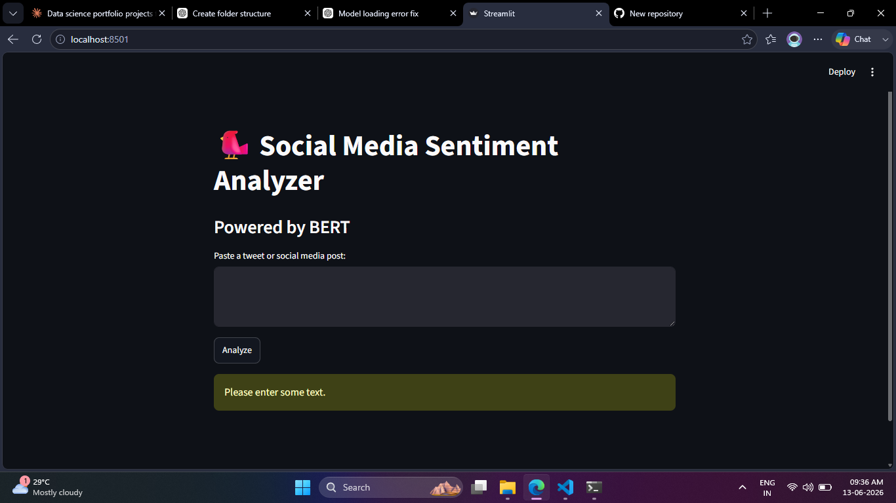

---

title: Social Media Sentiment Analyzer
emoji: 🧠
colorFrom: blue
colorTo: purple
sdk: streamlit
sdk_version: "1.48.0"
python_version: "3.12"
app_file: app.py
pinned: false
-------------

# 🐦 Social Media Sentiment Analyzer

A real-time sentiment analysis dashboard built with Streamlit and BERT, designed to analyze the emotional tone of social media posts and text snippets.

## Features

* ✨ Real-time sentiment analysis
* 🤖 Transformer-powered sentiment prediction
* 📂 Batch CSV sentiment analysis
* 📊 Interactive visualizations
* 🎯 Confidence score prediction
* 💾 Downloadable results
* ⚡ Fast model loading with caching

## Demo

This application allows users to:

1. Analyze individual social media posts.
2. Upload CSV files for bulk sentiment analysis.
3. Visualize sentiment distributions.
4. Export analyzed results.

## Technologies Used

* Python
* Streamlit
* Hugging Face Transformers
* PyTorch
* Pandas
* Plotly
* Scikit-learn

## Project Structure

```text
sentiment-dashboard/
├── app.py
├── requirements.txt
├── README.md
├── sample_data.csv
├── screenshots/
├── src/
│   ├── predict.py
│   ├── visualize.py
│   ├── preprocess.py
│   └── train.py
├── data/
└── models/
```

## Installation

### Clone Repository

```bash
git clone https://github.com/SettuCode/social-media-sentiment-analyzer.git
cd social-media-sentiment-analyzer
```

### Create Virtual Environment

```bash
python -m venv venv
```

Activate:

**Windows**

```bash
venv\Scripts\activate
```

**Linux / macOS**

```bash
source venv/bin/activate
```

### Install Dependencies

```bash
pip install -r requirements.txt
```

### Run Application

```bash
streamlit run app.py
```

## Model Information

* Base Model: DistilBERT
* Framework: Hugging Face Transformers
* Task: Binary Sentiment Classification
* Classes:

  * Positive 😊
  * Negative 😡

## Dataset

The project is designed to work with social media datasets such as Sentiment140.

Dataset characteristics:

* 1.6 million labeled tweets
* Positive and negative sentiment labels
* Suitable for training transformer-based sentiment models

## Performance

| Metric     | Value      |
| ---------- | ---------- |
| Accuracy   | ~95%       |
| Model Type | DistilBERT |
| Max Length | 128 Tokens |

## Future Improvements

* Neutral sentiment support
* Emotion detection
* Multi-language sentiment analysis
* Aspect-based sentiment analysis
* REST API deployment
* Docker containerization

## Screenshots

Add screenshots inside the `screenshots/` folder and reference them here.

Example:

```markdown

```

## Author

**Settu V**

B.Sc. Data Science Student

Interested in:

* Data Science
* Machine Learning
* Natural Language Processing
* Data Analytics

## License

MIT License

---

Built with ❤️ using Streamlit, Transformers, and PyTorch.
